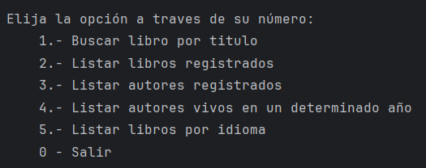
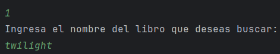
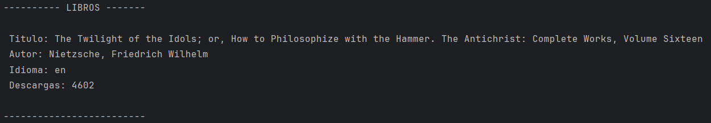
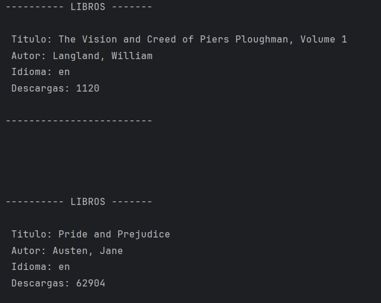
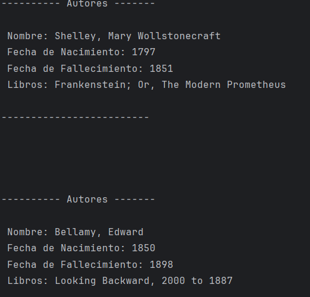
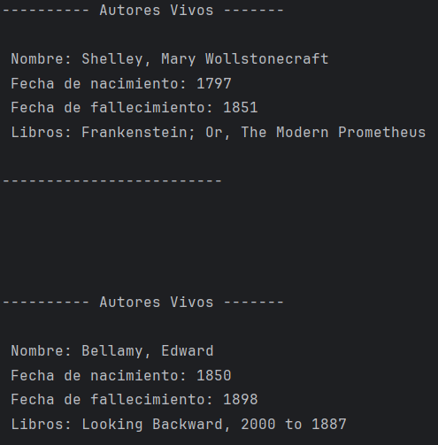
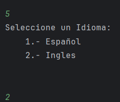
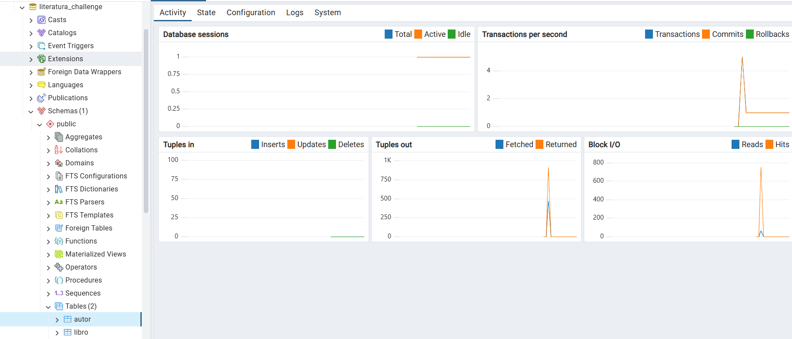

# 📚 Literatura Challenge

<p align = "center">

</p>

Este proyecto es un challenge de programación en Java enfocado en la gestión y exploración de libros. El programa permite interactuar con un menú que ofrece distintas opciones relacionadas con autores y libros.

## 🚀 Características

- Buscar libros por titulo.
- Listar libros registrados (se muestra libros que han sido buscados por la 1 opcion).
- Listar autores registrados (se muestra autores que han sido buscados por la 1 opcion).
- Listar autores vivos en un determinado año.
- Listar libros por idioma (limitado en ingles y español)

- ## 🛠️ Tecnologías utilizadas

- **Java** (JDK 21.0.6)
- API externa para tasas de cambio en tiempo real
- Springboot
## 📦 Cómo ejecutar

1. Clona este repositorio:
   ```bash
   git clone https://github.com/thort93/Literatura_challenge.git
   cd literatura_challenge
2. descomprimir los archivos rar

## 📦 DEMOSTRACION (CAPTURAS DE PANTALLA)

### Menu principal
- Al ejecutar la aplicacion nos muestra en siguiente menu
  


### Escogiendo las opciones.
- para este ejemplo escogemos la opcion 1 , ingresamos un nombre de un libro y nos muestra el siguiente resultado
  




- escogemos la opcion 2 y nos muestra el resultado
  


- escogemos la opcion 3 y nos muestra el resultado
  


- escogemos la opcion 4, escribimos una fecha y nos muestra el resultado




- escogemos la opcion 5, para luego escoger opcion de idioma y nos muestra el resultado
  



### guarda las consultas en la bd


